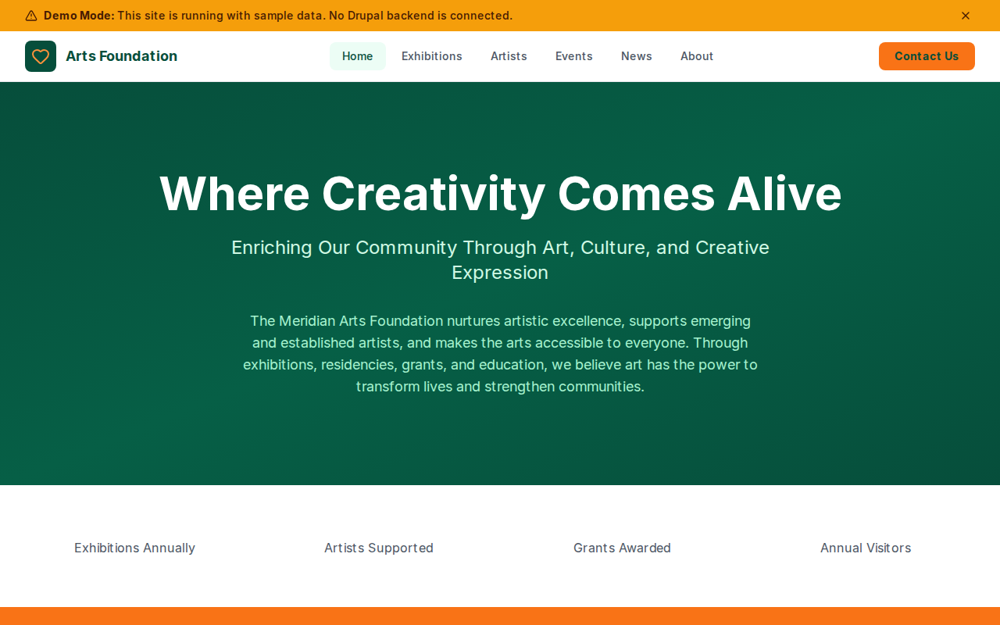

# Decoupled Arts Foundation

An arts and culture foundation website starter template for Decoupled Drupal + Next.js. Built for arts foundations, cultural centers, galleries, and nonprofit arts organizations presenting exhibitions, supporting artists, and engaging communities through creative programming.



## Features

- **Exhibitions** - Present current, upcoming, and past exhibitions with dates, galleries, curators, admission info, and featured imagery
- **Artists** - Showcase featured artists, residents, and grant recipients with bios, mediums, residency details, and portfolio links
- **Events** - Promote gallery openings, workshops, artist talks, performances, and community events with scheduling and admission details
- **News** - Publish foundation news, grant announcements, community program updates, and artist spotlights
- **Modern Design** - Clean, accessible UI optimized for arts and culture content

## Quick Start

### 1. Clone the template

```bash
npx degit nextagencyio/decoupled-arts-foundation my-arts-foundation
cd my-arts-foundation
npm install
```

### 2. Run interactive setup

```bash
npm run setup
```

This interactive script will:
- Authenticate with Decoupled.io (opens browser)
- Create a new Drupal space
- Wait for provisioning (~90 seconds)
- Configure your `.env.local` file
- Import sample content

### 3. Start development

```bash
npm run dev
```

Visit [http://localhost:3000](http://localhost:3000)

---

## Manual Setup

If you prefer to run each step manually:

<details>
<summary>Click to expand manual setup steps</summary>

### Authenticate with Decoupled.io

```bash
npx decoupled-cli@latest auth login
```

### Create a Drupal space

```bash
npx decoupled-cli@latest spaces create "My Arts Foundation"
```

Note the space ID returned (e.g., `Space ID: 1234`). Wait ~90 seconds for provisioning.

### Configure environment

```bash
npx decoupled-cli@latest spaces env 1234 --write .env.local
```

### Import content

```bash
npm run setup-content
```

This imports:
- Homepage with hero section, foundation statistics, and membership CTAs
- 3 Exhibitions (Color & Memory solo show, New Perspectives group show, Meridian Sculpture Garden permanent collection)
- 3 Artists (Elena Vasquez - painter, Kenji Tanaka - sculptor, Adwoa Osei - textile artist)
- 3 Events (Gallery opening reception, Spring watercolor workshop, Artist talk on sustainability)
- 3 News Articles (2026 Grant Recipients, $12M expansion groundbreaking, Youth program record enrollment)
- About page and Plan Your Visit page

</details>

## Content Types

### Exhibition
- **Start Date** - Exhibition opening date
- **End Date** - Exhibition closing date
- **Gallery/Location** - Where the exhibition is displayed
- **Exhibition Type** - Taxonomy (Solo Exhibition, Group Exhibition, Permanent Collection, Traveling Exhibition, Community Showcase)
- **Curator** - Exhibition curator name
- **Admission** - Pricing information
- **Exhibition Image** - Featured exhibition photograph

### Artist
- **Medium** - Taxonomy of artistic mediums (Painting, Sculpture, Photography, Mixed Media, Digital Art, Ceramics, Textile Arts)
- **Website** - Artist portfolio URL
- **Artist Type** - Classification (Featured Artist, Artist in Residence, Grant Recipient)
- **Residency Dates** - Duration of residency if applicable
- **Artist Photo** - Portrait photograph

### Event
- **Event Date** - Event start date and time
- **End Time** - Event end time
- **Location** - Venue within the arts center
- **Event Type** - Taxonomy (Gallery Opening, Workshop, Artist Talk, Performance, Community Event, Fundraiser)
- **Admission/Price** - Ticket or admission pricing
- **Event Image** - Promotional image

### News Article
- **Featured Image** - Article header image
- **Category** - Taxonomy (Exhibitions, Grants & Awards, Community Programs, Foundation News, Artist Spotlights)
- **Featured** - Boolean flag for homepage display

## Customization

### Colors & Branding
Edit `tailwind.config.js` to customize colors, fonts, and spacing.

### Content Structure
Modify `data/arts-foundation-content.json` to add or change content types and sample content.

### Components
React components are in `app/components/`. Update them to match your design needs.

## Demo Mode

Demo mode allows you to showcase the application without connecting to a Drupal backend.

### Enable Demo Mode

Set the environment variable:

```bash
NEXT_PUBLIC_DEMO_MODE=true
```

### Removing Demo Mode

To convert to a production app with real data:

1. Delete `lib/demo-mode.ts`
2. Delete `data/mock/` directory
3. Delete `app/components/DemoModeBanner.tsx`
4. Remove `DemoModeBanner` from `app/layout.tsx`
5. Remove demo mode checks from `app/api/graphql/route.ts`

## Deployment

### Vercel (Recommended)
[](https://vercel.com/new/clone?repository-url=https://github.com/nextagencyio/decoupled-arts-foundation)

Set `NEXT_PUBLIC_DEMO_MODE=true` in Vercel environment variables for a demo deployment.

### Other Platforms
Works with any Node.js hosting platform that supports Next.js.

## Documentation

- [Decoupled.io Docs](https://www.decoupled.io/docs)
- [Next.js Documentation](https://nextjs.org/docs)
- [Drupal GraphQL](https://www.decoupled.io/docs/graphql)

## License

MIT
